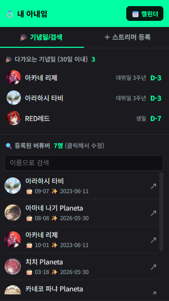
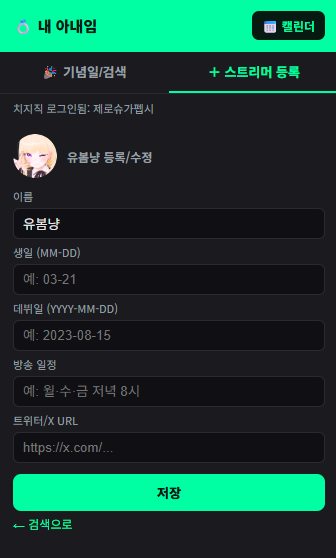
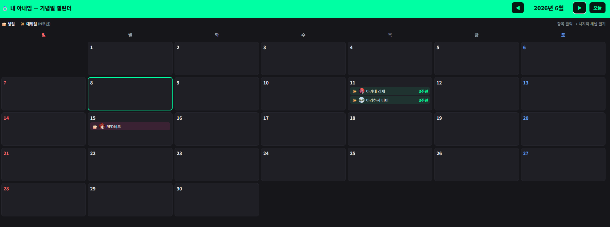

# 💍 chzzk-my-wife (치지직 "내 아내임")

치지직 버튜버의 **생일·데뷔일·방송 일정**을 함께 기록하고,
같은 확장을 쓰는 사람들끼리 **공유**하는 크롬 확장입니다.

> "내 아내임" 밈에서 출발 — 기억은 휘발되니까, 기념일은 다 같이 챙기자.

## 미리보기

  
  

월별 기념일 캘린더:

## 뭘 할 수 있나요?

- 🗂️ **버튜버 정보 등록/수정** — 생일·데뷔일·방송 일정·프로필을 누구나 채워넣는 위키 방식
- 🔔 **다가오는 기념일** — 30일 이내 생일·데뷔일을 D-day로, 다가오면 데스크톱 알림
- 📅 **월별 캘린더** — 그 달의 기념일을 한눈에
- 🟢 **치지직 채널 페이지 카드** — 채널에 들어가면 그 버튜버 정보가 바로 뜸
- 🤝 **공유** — 한 명이 입력하면 같은 확장을 쓰는 모두에게 반영

## 설치

[**릴리즈 페이지**](https://github.com/chzzk-zeropepsi/chzzk-my-wife/releases/latest)에서 zip을 받아
압축을 푼 뒤, 크롬 `chrome://extensions` → **개발자 모드** ON → **압축해제된 확장 프로그램을 로드** → 폴더 선택.

치지직 채널 페이지를 열면 우하단에 정보 카드가 뜹니다.
